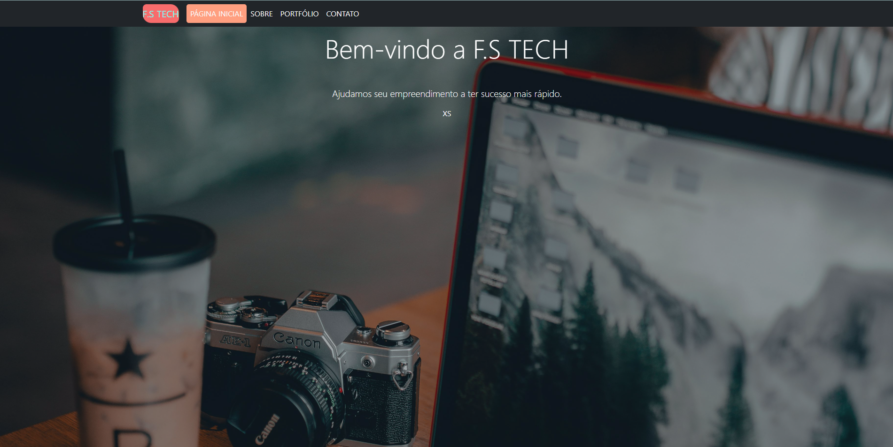
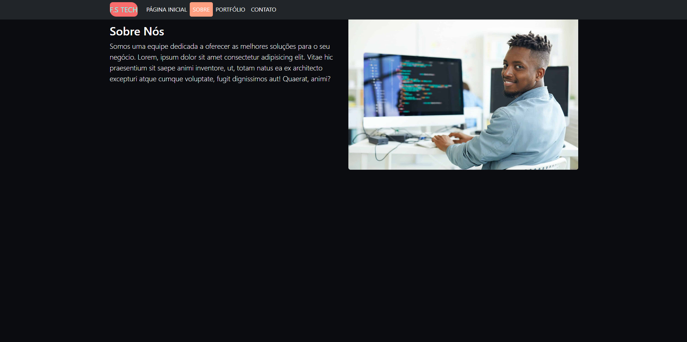
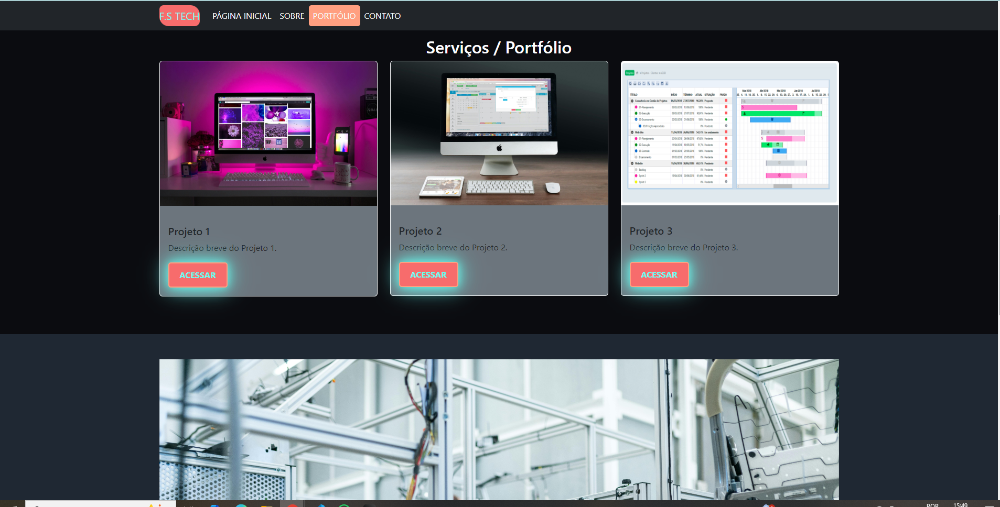
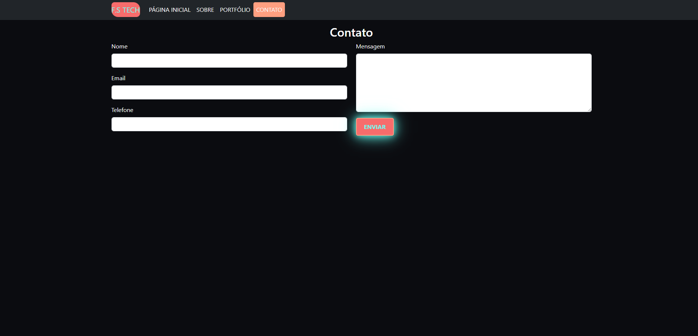

# Projeto de Site Responsivo com Bootstrap

## Visão Geral
Como parte das atividades práticas da disciplina de Programação Web, ministrada pelo professor Joan, foi desenvolvido um site responsivo com o framework Bootstrap. A proposta era criar uma interface web dinâmica e intuitiva, aproveitando as classes e componentes pré-definidos do Bootstrap para construir uma página que se adapta automaticamente a diferentes resoluções de tela, oferecendo uma experiência otimizada para o usuário em desktops, tablets e smartphones.

### Seções do Site:
- **Home**
- **Sobre**
- **Serviços/Portfólio**
- **Contato**

## Funcionalidades
- **Design Responsivo**: O layout se adapta a diferentes tamanhos de tela usando o sistema de grid do Bootstrap.
- **Barra de Navegação**: Um menu de navegação responsivo que se colapsa em dispositivos móveis.
- **Carrossel**: Um carrossel de imagens destacando o conteúdo principal na página inicial.
- **Formulário de Contato**: Um formulário de contato funcional criado com componentes de formulário do Bootstrap.
- **Estilo Personalizado**: CSS adicional foi aplicado para melhorar o design sem comprometer a responsividade.

## Tecnologias Utilizadas
As seguintes tecnologias foram utilizadas neste projeto:

- **HTML5** para a estrutura do site.
- **CSS3** para o estilo e design da página.
- **Bootstrap** para layout, componentes e responsividade.

## Capturas de Tela
Aqui estão algumas capturas de tela do projeto:

- **Página Inicial:**
  
  
  
- **Página Sobre:**
  
  
  
- **Página de Serviços/Portfólio:**
  
  
  
- **Página de Contato:**
  
  

## Contribuições
Este projeto foi desenvolvido em equipe. Cada membro contribuiu com diferentes seções do projeto conforme descrito abaixo:

- **Lucas Gonzaga**: Desenvolveu a barra de navegação e a página inicial.
- **C.Henrique Gonzaha**: Criou a seção de serviços/portfólio e trabalhou no layout do formulário de contato.
- **Melissa de Souza**: Adicionou CSS personalizado para estilização adicional e ajudou com a depuração.
- **Wesley B. Santana**: Trabalhou no carrossel e nas imagens responsivas, trabalhou com javascript adicional.
